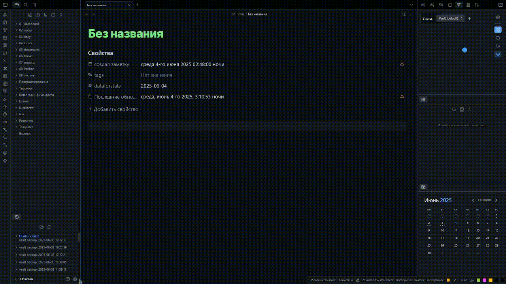

# 🖋️ Obsidian Draw\.io Plugin (Offline & Private)



> **A privacy-friendly, fully offline alternative to [obsidian-diagrams-net](https://github.com/jensmtg/obsidian-diagrams-net), preserving the full [Draw\.io (diagrams.net)](https://app.diagrams.net/) experience.**

---

## 🚀 Features

* 🛜 **Works 100% offline** – No internet required!
* 🔐 **Privacy-first** – Runs a local server on your machine.
* 🎨 **Full [Draw\.io](https://app.diagrams.net/) interface** – Keeps the original UI and functionality.
* ⚡ **Fast and lightweight** – Launches instantly inside your Obsidian vault.

---

## ❓ How It Works

This plugin launches a **local web server** that serves the [Draw.io web app](https://github.com/jgraph/drawio) directly from your machine.

* When you open your Obsidian vault and enable the plugin, it spins up the server automatically.
* You can then create, edit, and save diagrams directly within Obsidian — **completely offline**.

---

## 📦 Installation Guide

1. **Clone or download this repository**:

   ```bash
   git clone https://github.com/somesanity/draw-io-obsidian
   ```

   Or download the ZIP and extract it.

2. **Build the plugin** (if `main.js` is not present):

   ```bash
   npm install
   npm run dev
   ```

3. **Move some the plugin files to your Obsidian vault**:

   * Go to your Obsidian vault:

     ```
     .obsidian/plugins/
     ```

   * Create a folder, e.g., `draw-io`.

   * Copy these files and folders:

     ```
     manifest.json
     main.js
     webapp/
     ```

   > Your plugin directory should look like this:
   >
   > ```bash
   > .obsidian/
   > └── plugins/
   >     └── draw-io/
   >         ├── manifest.json
   >         ├── main.js
   >         └── webapp/     <-- This folder is essential!
   > ```

4. **Enable the plugin** in Obsidian:

   * Open **Settings → Community Plugins → Enable plugin**.

---


