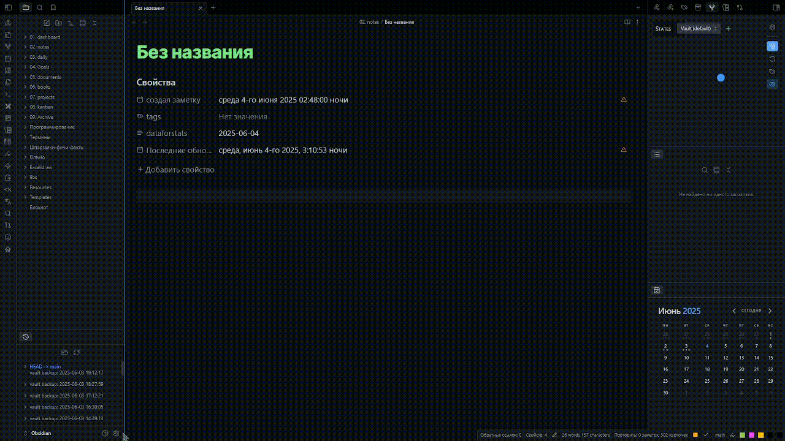
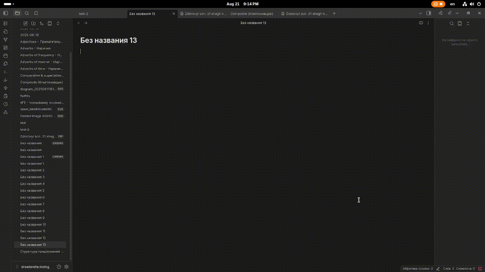
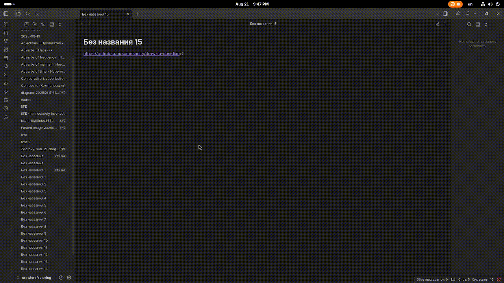
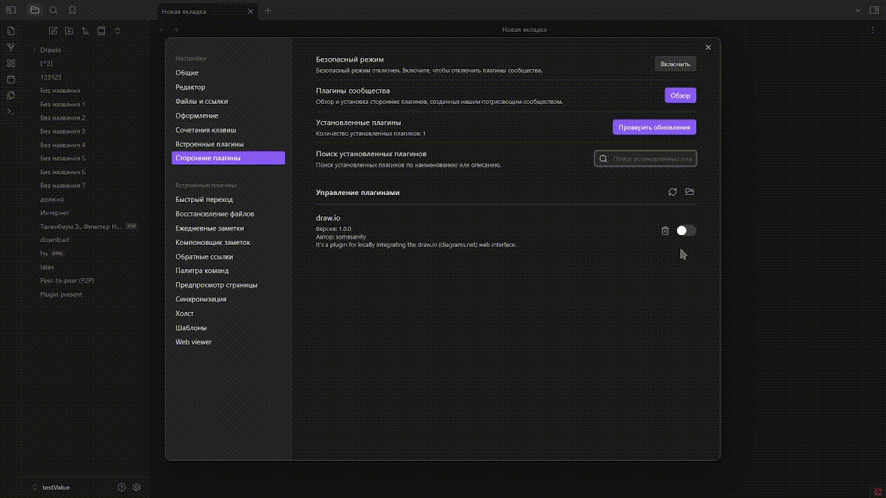
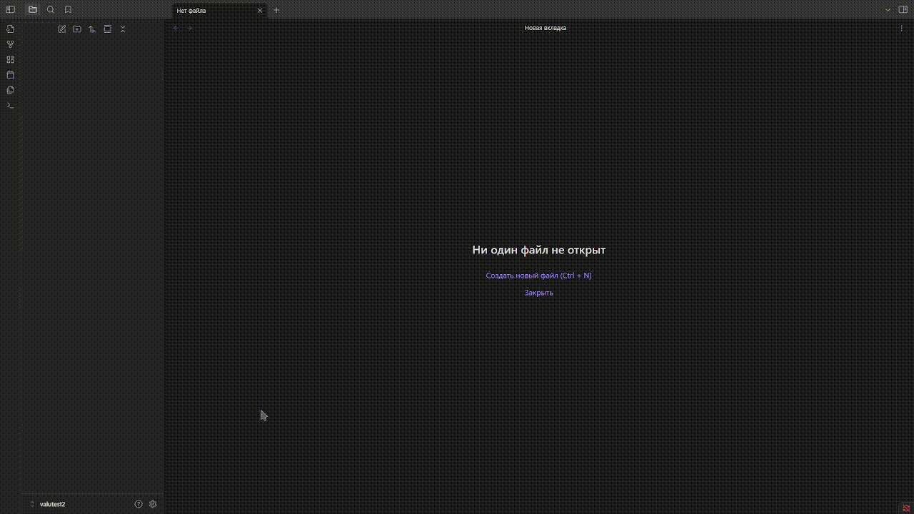

# 🔶 Plugin draw.io for obsidian



## 🚀 Features

  * 🧩 **Interactivity** – bind your note links to shapes, add external links, and insert markdown fragments!  
  * 🛜 **Works 100% offline** – No internet required!
  * 🔐 **Privacy-first** – Runs a local server on your machine.
  * 📐 **Mermaid & LaTeX** - Support Mermaid and LaTeX, and export pdf.
  * 🖼️ **Support Canvas** - Use diagram in Canvas, linking notes, add external links!

## ✨ Interactive diagrams


### 🖇️ Linking shapes with notes & external links

To link your notes or external resources to shapes, right-click on a shape in the editor and select `Add link`. Then, insert the link to your note or external resource.

🔗 linking notes demo:



🌐 creating an external link demo:



### 📄 Markdown fragments

**Markdown fragments** are pieces of markdown that you can add to diagrams.

Right-click on the shape or element you want to bind a markdown fragment to, then select `Add data...`.  
The data name should follow the pattern `md-number`, for example: `md-1`, `md-2`.  
Next, insert the markdown text into the property.

📜 Adding a markdown fragment demo:


### 📐 Mermaid & LaTeX

You can use mermaid and LaTeX (Default support in draw.io)


### 🖼️ Canvas support

Use the diagrams in canvas! Link your notes, add external/internal links and markdown-fragments!


## ❓ How It Works

This plugin launches a **local web server** that serves the [Draw.io web app](https://github.com/jgraph/drawio) directly from your machine.

  * When you open your Obsidian vault and enable the plugin, it spins up the server automatically.
  * You can then create, edit, and save diagrams directly within Obsidian — **completely offline**.

## 📦 Installation Guide

there are 2 ways: 

1. using plugin for obsidian - [BRAT](https://github.com/TfTHacker/obsidian42-brat)
2. manually install


>📌 The `drawioclient` folder, which contains the core Draw.io application, is crucial for this plugin to function correctly. Because GitHub doesn't allow direct folder uploads and to ensure faster downloads, the `drawioclient` content is provided as an archive. A small script (`drawIoClientManager.ts`) will automatically extract it for you upon installation. Please allow a brief moment for this process to complete.!



> This only needs to be done once.

### 🕗 Install with using BRAT



1. install [BRAT from repository](https://github.com/TfTHacker/obsidian42-brat) or from [obsidian plugin list](obsidian://show-plugin?id=obsidian42-brat)
2. open BRAT plugin `settings` > click `Add beta-plugin`
3. paste in input `https://github.com/somesanity/draw-io-obsidian` select version and click to `Add plugin`.

### 🙌 manually install

1.  **Clone or download this repository**:

    ```bash
    git clone https://github.com/somesanity/draw-io-obsidian
    ```

    Or download the ZIP and extract it.

2.  **Build the plugin**

    ```bash
    npm install
    npm run dev
    ```

3.  **Move the plugin files to your Obsidian vault**:

      * Go to your Obsidian vault:

        ```
        .obsidian/plugins/
        ```

      * Create a folder, e.g., `draw-io`.

      * Copy these files and folders:

        ```
        manifest.json
        main.js
        drawioclient/
        styles.css
        ```

    > Your plugin directory should look like this:

    > ```bash
    > .obsidian/
    > └── plugins/
    >     └── draw-io/
    >         ├── manifest.json
    >         ├── main.js
    >         ├── styles.css
    >         └── drawioclient   <-- This folder is essential!
    > ```

4.  **Enable the plugin** in Obsidian:

      * Open **Settings → Community Plugins → Enable plugin**.

### 🛠️ How update draw.io webapp

This plugin’s main benefit is that it’s just a connector between draw.io and Obsidian. It isn't locked to any fixed version; you can manually update it by swapping the webapp folder with the one from [the official repository](https://github.com/jgraph/drawio/tree/dev/src/main/webapp). Even if the plugin is no longer maintained, you can keep draw.io current on your own.