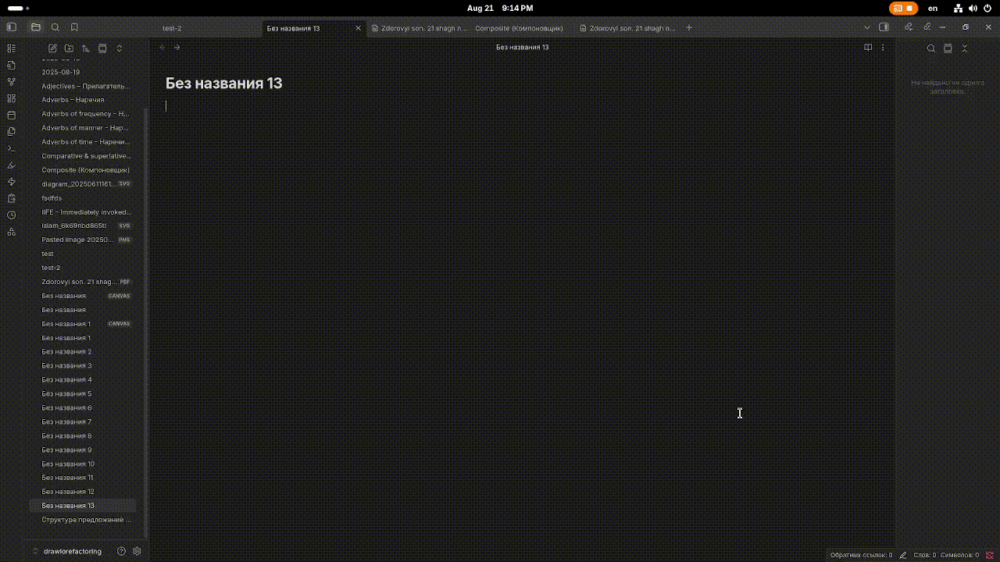
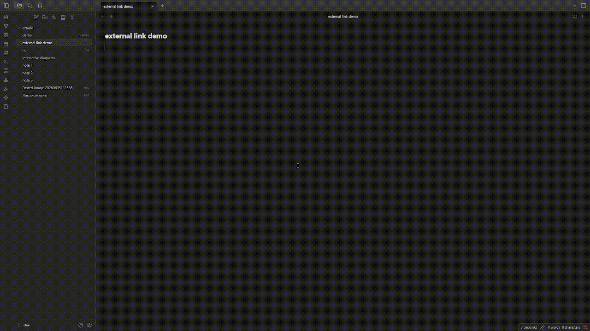
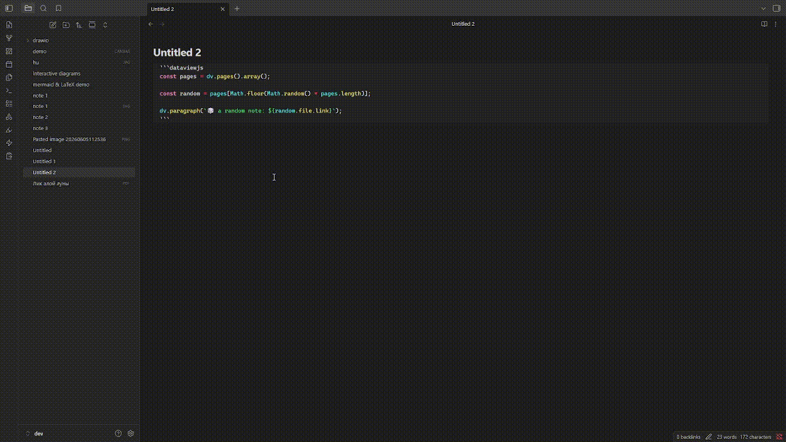
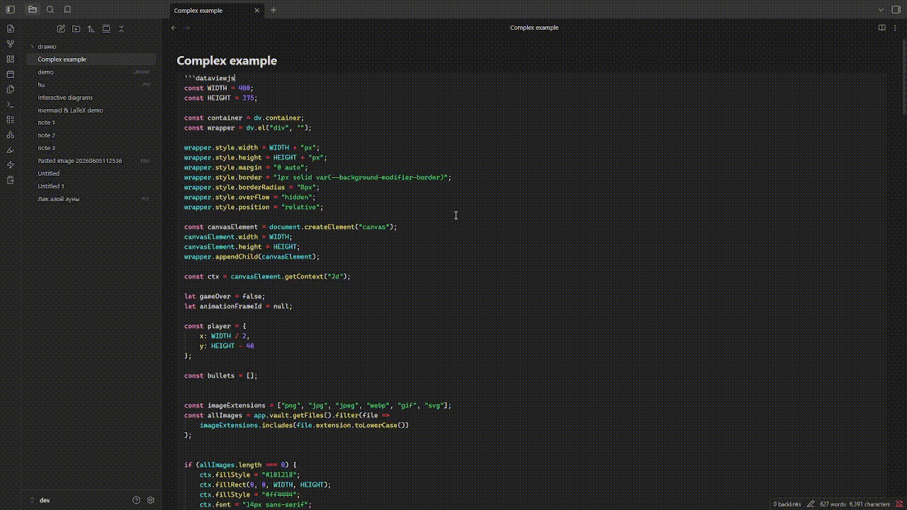
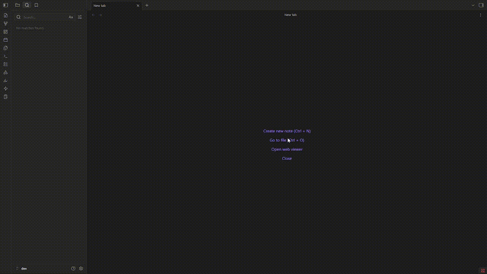
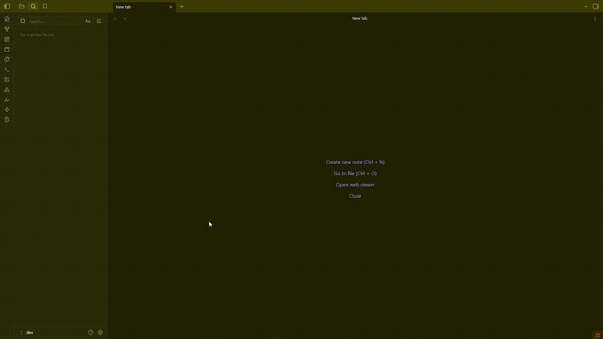
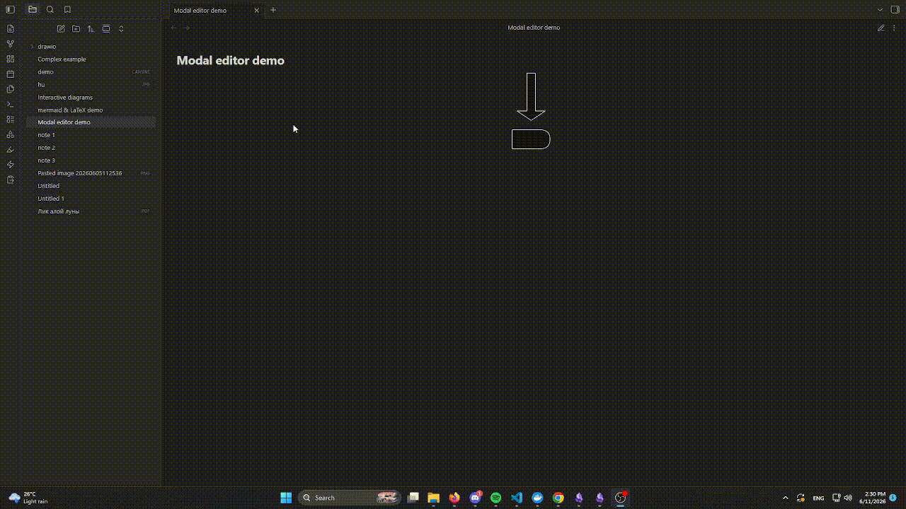
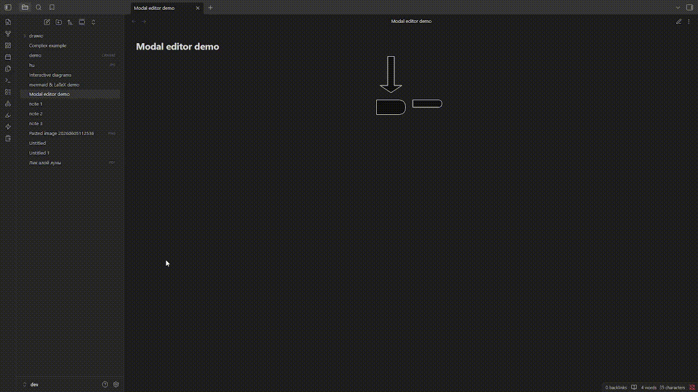
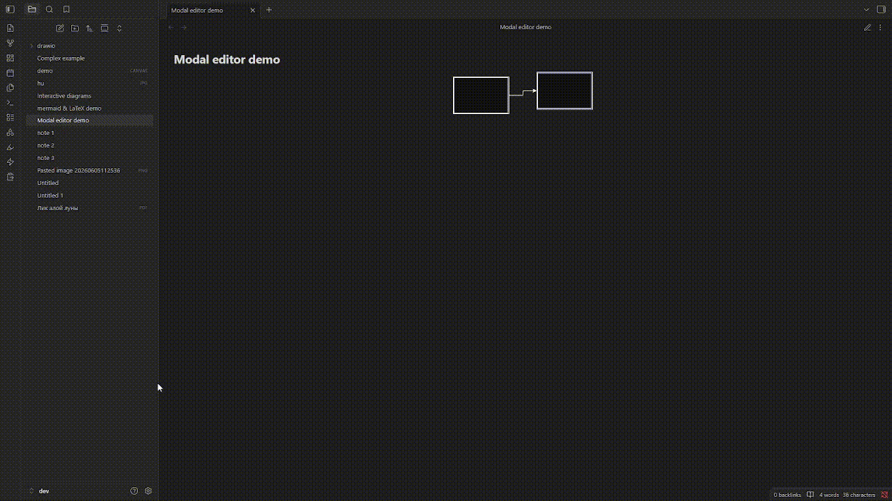
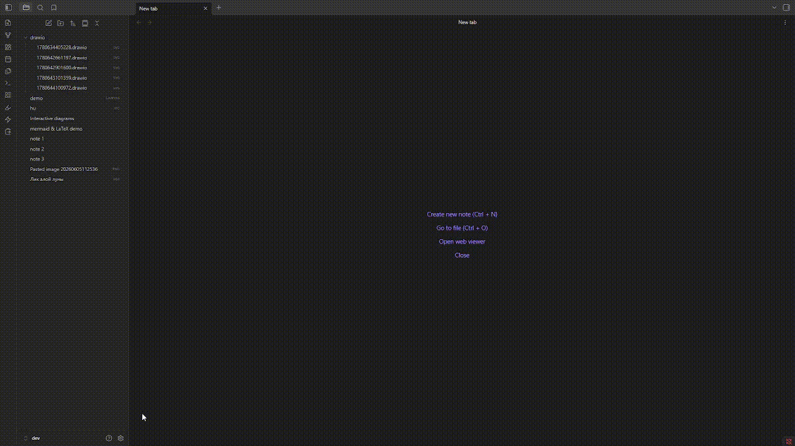

# 🔶 Plugin draw.io for obsidian


## 🚀 Features

  * 🧩 **Interactivity** – bind your note links to shapes, add external links, and insert markdown fragments!  
  * 🛜 **Works 100% offline** – No internet required!
  * 🔐 **Privacy-first** – Runs a local server on your machine.
  * 📐 **Mermaid & LaTeX** - the draw.io native support Mermaid and LaTeX.
  * 🖼️ **Support Canvas** - Use diagram in Canvas, linking notes, add external links!

## ✨ Interactive diagrams

> ⚠️ at the moment, work **ONLY** the reading mode


### 🖇️ Linking shapes with notes & external links

To link your notes or external resources to shapes, right-click on a shape in the editor and select `Add link`. Then, insert the link to your note or external resource.

🔗 linking notes demo:



🌐 creating an external link demo:



### 📄 Markdown fragments

**Markdown fragments** are pieces of markdown that you can add to diagrams.

Right-click on the shape or element you want to bind a markdown fragment to, then select `Add data...`.  
The data name should follow the pattern `md-number`, for example: `md-1`, `md-2`.  
Next, insert the markdown text into the property.

📜 Adding a markdown fragment demo:


You can literally put **anything** into a diagram that Obsidian is capable of rendering, including rendering features added by plugins.

for example:

- random note
  
- complex dataviewjs scripts
  

### 📐 Mermaid & LaTeX

You can use mermaid, plumt and LaTeX (native support draw.io)


### 🖼️ Canvas support

Use the diagrams in canvas! Link your notes, add external/internal links and markdown-fragments!


## 🖱️ How to Use

Diagrams created by the plugin use the `.drawio.svg` extension. The file is still a regular SVG file; the `.drawio` part is added so the plugin can recognize that the SVG was created by it.

- `diagram.drawio.svg` — ✔️
- `diagram.svg` — ❌

If you remove the `.drawio` part, the plugin will no longer recognize the file as a draw.io diagram.

### How to Open the Editor

You can open the editor using a Command Palette command:



Or you can assign and use a keyboard shortcut:



### How to Edit Diagrams

There are three ways to edit a diagram:

1. **Using the context menu** — right-click the diagram link and select **"Edit draw.io Diagram"**.



2. **Using a keyboard shortcut** — place the cursor on the diagram link in editing mode and press the assigned shortcut.



3. **Using the modal editor shortcut** — place the cursor on the diagram link in editing mode and press the modal editor shortcut.



## ❓ How It Works

This plugin launches a **local web server** that serves the [Draw.io web app](https://github.com/jgraph/drawio) directly from your machine.

  * When you open your Obsidian vault and enable the plugin, it spins up the server automatically.
  * You can then create, edit, and save diagrams directly within Obsidian — **completely offline**.

## 📦 Installation Guide

there are 2 ways: 

1. install from the [plugin page](https://community.obsidian.md/plugins/drawio) or open this link obsidian://show-plugin?id=drawio in new browser tab
  > after downloading enable plugin, then go to settings, scroll down and click on the downlaod button draw.io client
2. manually install

2. after downloadingб 

### 🙌 manually install

1. downlaod from Releases

    - `main.js` 
    - `manifest.json`
    - `style.css`

2. create Folder in the .obsidian folder (where other plugin) and then move the file to the folder.

    > ```bash
    > .obsidian/
    > └── plugins/
    >     └── draw-io/
    >         ├── manifest.json
    >         ├── main.js
    >         ├── styles.css
    > ```

3. enable plugin, then go to settings, scroll down and click on the downlaod button draw.io client



### License

This software is licensed under the [GNU GPLv3](./LICENSE).