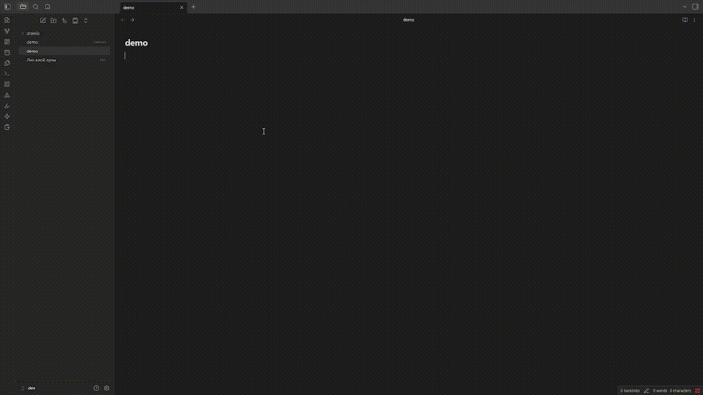
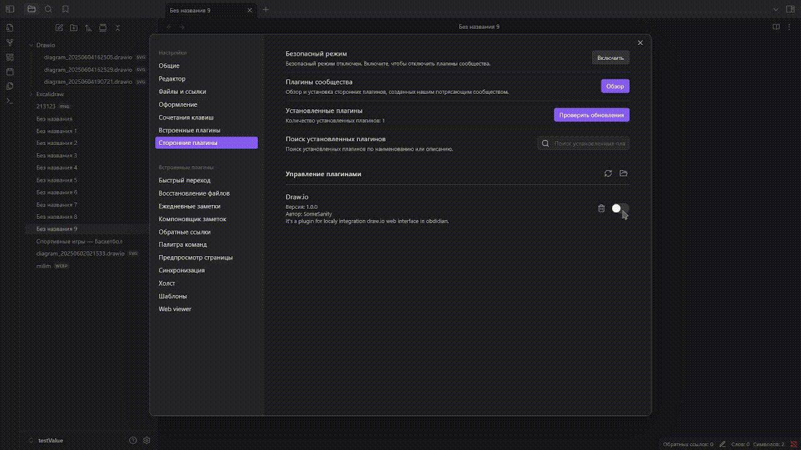
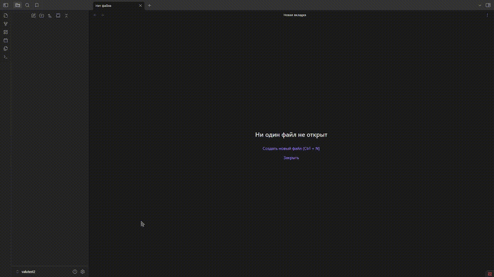

# 🔶 Plugin draw.io for obsidian



> **A privacy-friendly, fully offline alternative to [obsidian-diagrams-net](https://github.com/jensmtg/obsidian-diagrams-net), preserving the full [Draw.io (diagrams.net)](https://app.diagrams.net/) experience.**

## 🚀 Features

  * 🛜 **Works 100% offline** – No internet required\!
  * 🔐 **Privacy-first** – Runs a local server on your machine.
  * 🎨 **Full [Draw.io](https://app.diagrams.net/) interface** – Keeps the original UI and functionality.
  * ⚡ **Fast and lightweight** – Launches instantly inside your Obsidian vault.

## ❓ How It Works

This plugin launches a **local web server** that serves the [Draw.io web app](https://github.com/jgraph/drawio) directly from your machine.

  * When you open your Obsidian vault and enable the plugin, it spins up the server automatically.
  * You can then create, edit, and save diagrams directly within Obsidian — **completely offline**.

## 📦 Installation Guide

there are 2 ways: 

1. using plugin for obsidian - [BRAT](https://github.com/TfTHacker/obsidian42-brat)
2. manually install


>📌 The `drawioclient` folder, which contains the core Draw.io application, is crucial for this plugin to function correctly. Because GitHub doesn't allow direct folder uploads and to ensure faster downloads, the `drawioclient` content is provided as an archive. A small script (`drawIoClientManager.ts`) will automatically extract it for you upon installation. Please allow a brief moment for this process to complete.!



> This only needs to be done once.

### 🕗 Install with using BRAT



1. install [BRAT from repository](https://github.com/TfTHacker/obsidian42-brat) or from [obsidian plugin list](obsidian://show-plugin?id=obsidian42-brat)
2. open BRAT plugin `settings` > click `Add beta-plugin`
3. paste in input `https://github.com/somesanity/draw-io-obsidian` select version and click to `Add plugin`.

### 🙌 manually install

1.  **Clone or download this repository**:

    ```bash
    git clone https://github.com/somesanity/draw-io-obsidian
    ```

    Or download the ZIP and extract it.

2.  **Build the plugin**

    ```bash
    npm install
    npm run dev
    ```

3.  **Move the plugin files to your Obsidian vault**:

      * Go to your Obsidian vault:

        ```
        .obsidian/plugins/
        ```

      * Create a folder, e.g., `draw-io`.

      * Copy these files and folders:

        ```
        manifest.json
        main.js
        drawioclient/
        ```

    > Your plugin directory should look like this:

    > ```bash
    > .obsidian/
    > └── plugins/
    >     └── draw-io/
    >         ├── manifest.json
    >         ├── main.js
    >         └── drawioclient   <-- This folder is essential!
    > ```

4.  **Enable the plugin** in Obsidian:

      * Open **Settings → Community Plugins → Enable plugin**.
